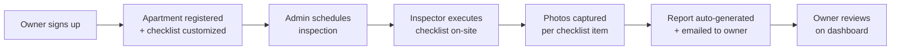
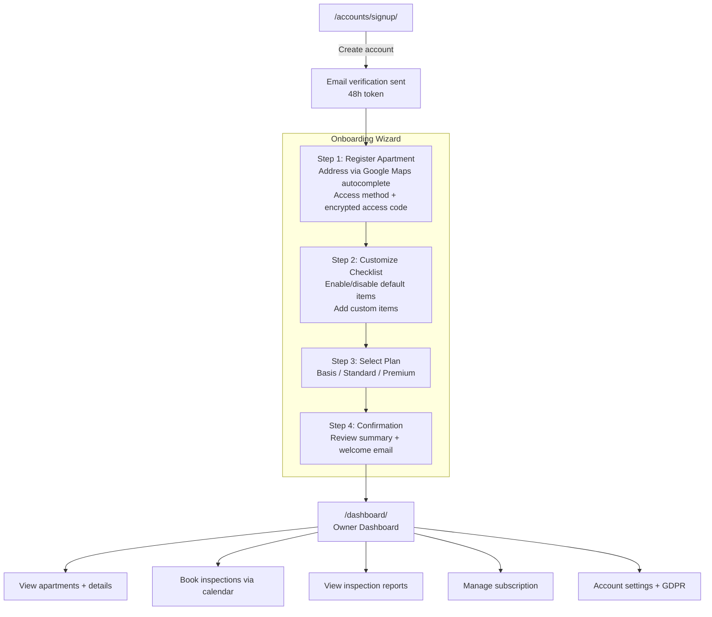
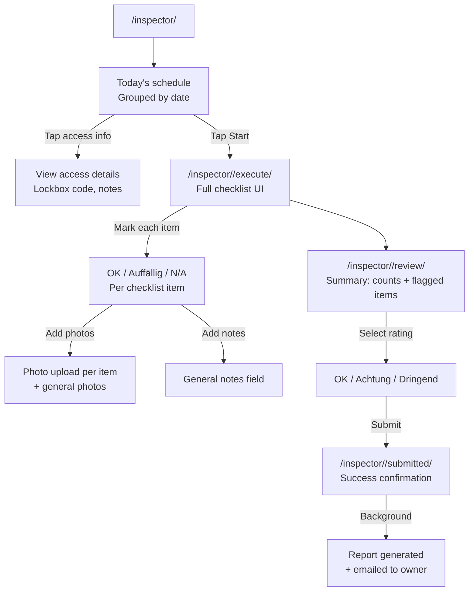
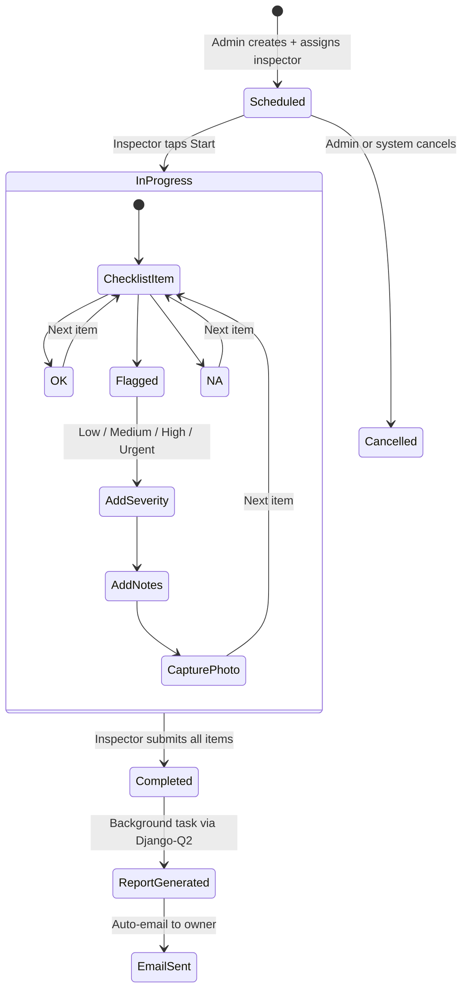

# BAKY

**Betreuung. Absicherung. Kontrolle. Your Home.**

Apartment monitoring and inspection platform for short-term rentals in Vienna.

## What is BAKY?

BAKY helps property owners maintain oversight of their short-term rental apartments between guest stays. We schedule professional inspections, execute checklist-based walkthroughs with photo documentation, and deliver instant reports.

## Business Process

### How It Works



### User Roles and Access

| Role | How they join | Login | Landing page | What they do |
|------|--------------|-------|-------------|-------------|
| **Owner** | Self-signup at `/accounts/signup/` | `/accounts/login/` → `/dashboard/` | Owner Dashboard | Registers apartments, customizes checklists, selects plan, views inspection reports |
| **Inspector** | Created by Admin in Django Admin | `/accounts/login/` → `/inspector/` | Inspector Schedule | Views daily assignments, executes checklists on-site, captures photos, submits inspections |
| **Admin** | `make createsuperuser` | `/accounts/login/` → `/admin/` | Django Admin | Manages users, schedules inspections, assigns inspectors, monitors platform |

All roles share a single login page. After login, users are redirected based on their role.

### Owner Journey (Signup to Reports)



### Owner Dashboard Flows

**Apartment Management**
- View all apartments with status badges (Aktiv/Pausiert), last/next inspection dates and ratings
- Click into apartment detail: address, access method, full checklist, recent inspections
- Edit apartment: change address, access method/code, access notes, special instructions, status

**Booking Calendar**
- Select apartment from dropdown to see weekly calendar view
- 3 time slots per day: 08:00-10:30, 10:30-13:00, 13:30-16:00
- Color-coded slots: green (available), amber (your booking), grey (taken/past)
- Book a slot with confirmation dialog; cancel booking with cancellation confirmation
- 24-hour advance booking rule enforced; double-booking prevented
- Subscription progress bar shows used/total inspections this month

**Subscription Management**
- Overview: plan, price, billing date, inspection usage
- Change plan: request upgrade/downgrade (sends confirmation email)
- Pause subscription: request pause (sends confirmation email)
- Cancel subscription: request cancellation with optional reason (sends confirmation email)
- Extra inspections: book additional inspections outside plan
- Billing history

**Account & GDPR**
- Account deletion: password-confirmed, 30-day soft-delete grace period
- Cancel deletion: recover account within 30 days via `/accounts/delete-cancel/`
- GDPR data export: request ZIP export of all personal data (DSGVO Art. 15)

### Inspector Mobile Flow



**Inspector checklist execution:**
- 22 default checklist items across 8 categories (Allgemeiner Eindruck, Kuche, Badezimmer, Wohnbereiche, Gerate, Schlafzimmer, Zugang & Sicherheit, Nach der Reinigung)
- Each item: OK / Auffällig (flagged) / N/A with optional photos and notes
- Review page shows counts (OK/Auffällig/N/A), lists flagged items, requires overall rating
- Submit button disabled until overall rating selected
- On submission: inspection marked completed, report auto-generated as HTML, email sent to owner

### Inspection Lifecycle



### Overall Rating

| Rating | Meaning | Trigger |
|--------|---------|---------|
| **OK** | All good | All items OK or N/A |
| **Attention** | Some issues | Any item flagged with low/medium severity |
| **Urgent** | Critical issues | Any item flagged with high/urgent severity |

## URL Map

| Area | URL | Auth | Description |
|------|-----|------|-------------|
| **Public** | `/` | -- | Landing page (hero, features, FAQ, testimonials) |
| | `/preise/` | -- | Pricing (3 tiers with FAQ) |
| | `/impressum/` | -- | Legal notice |
| | `/datenschutz/` | -- | Privacy policy |
| | `/agb/` | -- | Terms of service |
| **Auth** | `/accounts/login/` | -- | Login (email or username, all roles) |
| | `/accounts/signup/` | -- | Owner self-signup (accepts `?plan=` from pricing) |
| | `/accounts/verify/<token>/` | -- | Email verification |
| | `/accounts/onboarding/*` | Owner | 4-step onboarding (apartment, checklist, plan, confirm) |
| | `/accounts/password-reset/` | -- | Password reset (email link flow) |
| | `/accounts/delete-cancel/` | -- | Cancel account deletion (within 30-day grace) |
| **Dashboard** | `/dashboard/` | Owner | Apartment list with status/inspection overview |
| | `/dashboard/apartments/<id>/` | Owner | Apartment detail (checklist, recent inspections) |
| | `/dashboard/apartments/<id>/edit/` | Owner | Edit apartment (address, access, status) |
| | `/dashboard/apartments/<id>/inspections/` | Owner | Inspection timeline with filters |
| | `/dashboard/apartments/<id>/inspections/<id>/report/` | Owner | Full inspection report |
| | `/dashboard/buchen/` | Owner | Booking calendar (weekly view, 3 slots/day) |
| | `/dashboard/subscription/` | Owner | Subscription overview |
| | `/dashboard/subscription/change/` | Owner | Request plan change |
| | `/dashboard/subscription/pause/` | Owner | Request pause |
| | `/dashboard/subscription/cancel/` | Owner | Request cancellation |
| | `/dashboard/account/delete/` | Owner | Delete account (password-confirmed) |
| | `/dashboard/account/export/` | Owner | GDPR data export request |
| **Inspector** | `/inspector/` | Inspector | Today's schedule with access details |
| | `/inspector/schedule/` | Inspector | Full schedule view |
| | `/inspector/<id>/execute/` | Inspector | Checklist execution (OK/Flag/N.A. per item) |
| | `/inspector/<id>/review/` | Inspector | Review summary + overall rating |
| | `/inspector/<id>/submit/` | Inspector | Submit completed inspection |
| **Admin** | `/admin/` | Admin | Full platform management (django-unfold) |

## Plans and Pricing

| Feature | Basis (€89/mo) | Standard (€149/mo) | Premium (€249/mo) |
|---------|----------------|--------------------|--------------------|
| Inspections per month | 2 | 4 | 8 |
| Photo documentation | Yes | Yes | Yes |
| Instant digital reports | Yes | Yes | Yes |
| Custom checklist | Yes | Yes | Yes |
| Immediate problem alerts | Yes | Yes | Yes |
| Preferred scheduling | -- | Yes | Yes |
| Priority scheduling | -- | -- | Yes |
| Personal contact | -- | -- | Yes |

All plans are per apartment, monthly cancellable. Plan changes, pauses, and cancellations are requested through the dashboard and processed within 1-2 business days.

## Email Notifications

All emails are sent via Resend (Mailpit in development at http://localhost:8026).

| Trigger | Recipient | Subject |
|---------|-----------|---------|
| Account signup | New user | Willkommen bei BAKY! |
| Email verification | New user | BAKY — E-Mail-Adresse bestatigen |
| Password reset | User | BAKY — Passwort zurucksetzen |
| Inspection completed | Owner | BAKY Inspektionsbericht — [Address] — [Date] |
| Booking created | Admin | Neue Buchung — [Address] ([Slot]) |
| Booking cancelled | Admin | Stornierung — [Address] ([Slot]) |
| Plan change requested | Owner | Bestatigung: Ihre Plananderung wurde gesendet |
| Pause requested | Owner | Bestatigung: Ihre Pausierung wurde angefragt |
| Cancellation requested | Owner | Bestatigung: Ihre Kundigung wurde angefragt |

## Authentication & Security

- **Login accepts email**: Users register with email but login resolves email to username transparently
- **Role-based access**: Owners see only their own apartments (404 for others); inspectors can't access owner pages; unauthenticated users get redirected to login
- **CSRF protection**: All forms include CSRF tokens; logout is POST-only
- **Encrypted fields**: Access codes and notes are stored encrypted (`EncryptedCharField`/`EncryptedTextField`)
- **Account deletion**: Password-confirmed, 30-day soft-delete grace period with recovery option
- **Password reset**: Email-based flow with time-limited tokens

## Quick Start

```bash
# Prerequisites: Docker only
make up
make migrate
make seed
# Visit http://localhost:8010
# Mailpit UI: http://localhost:8026
```

## Development

This project is built with Claude Code. See [CLAUDE.md](CLAUDE.md) for conventions, architecture, and workflow.

## Production Deployment

Production runs on the Devs Group server via Docker Compose. The server does not contain a Git checkout of this repository; it contains a Compose project that pulls the published GHCR image.

### Deploy Steps

```bash
# 1. Commit and push to main. GitHub Actions builds and pushes:
#    ghcr.io/robert197/baky:latest
git push origin main

# 2. SSH into production
ssh devsgroup@45.83.105.86 -p 2222

# 3. Pull the latest image and restart services
cd ~/websites/baky
docker compose pull web worker
docker compose run --rm web python manage.py migrate --noinput
docker compose up -d web worker

# 4. Verify
docker compose ps
curl -fsS https://baky.at/health/
```

Production Compose path: `~/websites/baky/docker-compose.yml`.

The public production URL configured in Traefik is `https://baky.at`. `https://www.baky.at` redirects to the apex domain.

### Key Make Targets

```bash
make up              # Start all services
make down            # Stop all services
make test            # Run pytest suite
make lint            # Run ruff + djlint
make migrate         # Run migrations
make seed            # Load demo/seed data
make shell           # Django shell
make createsuperuser # Create admin user
```

### Custom Skills

| Skill | Description |
|-------|------------|
| `/next-issue` | Pick the next issue from the roadmap |
| `/done-issue` | Complete current issue (verify, commit, PR, close) |
| `/baky-status` | Quick project status overview |
| `/validate` | Run full validation suite (lint + tests + e2e) |
| `/autopilot` | Start Ralph Loop for autonomous MVP development |

### Roadmap

See [Issue #44](https://github.com/robert197/baky/issues/44) for the full build order with dependencies.

**Build phases:**
1. **Foundation** -- Django project, Docker, testing, design system (done)
2. **Data Layer** -- Models, auth, checklists, storage, admin (done)
3. **Public Website** -- Landing, pricing, legal, signup/onboarding (done)
4. **Inspector App** -- Scheduling, daily view, checklist execution, photo capture, submission (done)
5. **Reports** -- Auto-generation from inspection data, email delivery (done)
6. **Owner Dashboard** -- Apartment list, inspection timeline, booking calendar, subscription management (done)
7. **Compliance and Launch** -- GDPR (data export, account deletion), seed data, CI/CD, production deployment (in progress)

## Tech Stack

Django 5.x + HTMX + Alpine.js + Tailwind CSS + PostgreSQL -- all running in Docker.

| Layer | Technology |
|-------|-----------|
| Backend | Django 5.x (Python 3.12) |
| Frontend | Django Templates + HTMX + Alpine.js |
| Styling | Tailwind CSS |
| Database | PostgreSQL 16 |
| File Storage | AWS S3 / Cloudflare R2 |
| Background Tasks | Django-Q2 |
| Email | Resend |
| Admin | Django Admin + django-unfold |
| Hosting | Docker everywhere |

## Deployment (SSH method)

BAKY runs as a Docker Compose stack on a single Linux VPS. CI builds images and pushes them
to **GitHub Container Registry** (`ghcr.io/robert197/baky`); the server pulls the latest image
over SSH and recreates the stack with `docker-compose.prod.yml`.

### One-time server setup

Run on the production host as root (or sudo user):

```bash
# 1. Install Docker Engine + Compose plugin
curl -fsSL https://get.docker.com | sh
sudo apt-get install -y docker-compose-plugin

# 2. Create deploy user that can run docker
sudo useradd -m -s /bin/bash baky
sudo usermod -aG docker baky

# 3. Add your SSH public key
sudo mkdir -p /home/baky/.ssh
sudo cp ~/.ssh/authorized_keys /home/baky/.ssh/authorized_keys
sudo chown -R baky:baky /home/baky/.ssh
sudo chmod 700 /home/baky/.ssh && sudo chmod 600 /home/baky/.ssh/authorized_keys

# 4. App directory
sudo -u baky mkdir -p /srv/baky /srv/baky/backups
```

Place these files in `/srv/baky/` on the server:

| File | Source | Notes |
|------|--------|-------|
| `docker-compose.prod.yml` | This repo | `scp` from your machine, or `curl` from a release tag |
| `.env.production`         | Created on server | Use `.env.example` as template — never commit secrets |
| `gunicorn.conf.py`        | Baked into image | Nothing to do |

Log in to GHCR so the server can pull the image (one-time):

```bash
echo "$GHCR_PAT" | docker login ghcr.io -u robert197 --password-stdin
```
`GHCR_PAT` is a GitHub Personal Access Token with `read:packages` scope.

### TLS / reverse proxy

Put **Caddy** (or **nginx + Certbot**) in front of the `web` container on `127.0.0.1:8000`.
Caddy is the shortest path:

```caddyfile
baky.at, www.baky.at {
    reverse_proxy 127.0.0.1:8000
    encode zstd gzip
}
```

Caddy handles Let's Encrypt automatically. Make sure `ALLOWED_HOSTS` and
`CSRF_TRUSTED_ORIGINS` in `.env.production` match `baky.at` and `www.baky.at`.

### Deploy a new release

CI pushes `ghcr.io/robert197/baky:latest` (and `:sha-<commit>`) on every push to `main`. Roll
out by pulling + recreating on the server:

```bash
ssh baky@baky.at
cd /srv/baky

# 1. Pull latest image
docker compose -f docker-compose.prod.yml pull

# 2. Recreate web + worker (db keeps running)
docker compose -f docker-compose.prod.yml up -d --remove-orphans

# 3. Run migrations
docker compose -f docker-compose.prod.yml exec web python manage.py migrate --noinput

# 4. Verify
curl -fsS https://baky.at/health/
```

### One-shot deploy from your machine

```bash
ssh baky@baky.at '
  cd /srv/baky &&
  docker compose -f docker-compose.prod.yml pull &&
  docker compose -f docker-compose.prod.yml up -d --remove-orphans &&
  docker compose -f docker-compose.prod.yml exec -T web python manage.py migrate --noinput &&
  curl -fsS http://localhost:8000/health/
'
```

Wrap that into `bin/deploy.sh` if you want a `make deploy` target later.

### Rollback

```bash
ssh baky@baky.at
cd /srv/baky
IMAGE_TAG=sha-<previous-commit> docker compose -f docker-compose.prod.yml up -d
```

(For this to work, reference `image: ghcr.io/robert197/baky:${IMAGE_TAG:-latest}` in
`docker-compose.prod.yml`.) If a migration is the problem, restore the database from the
latest dump in `/srv/baky/backups/` before rolling the image back.

### Backups

Daily `pg_dump` via host crontab:

```cron
0 3 * * * docker compose -f /srv/baky/docker-compose.prod.yml exec -T db \
  pg_dump -U $POSTGRES_USER $POSTGRES_DB | gzip > /srv/baky/backups/baky-$(date +\%F).sql.gz
```

Keep ~14 days locally; ship one offsite (S3/R2) weekly.

### Required environment variables

See `.env.example` for the full list. Production needs at minimum: `SECRET_KEY`, `DEBUG=False`,
`ALLOWED_HOSTS`, `CSRF_TRUSTED_ORIGINS`, `DATABASE_URL`, `FIELD_ENCRYPTION_KEY`,
`RESEND_API_KEY`, AWS S3/R2 credentials, and `POSTGRES_DB` / `POSTGRES_USER` /
`POSTGRES_PASSWORD` for the bundled `db` service.

## License

Proprietary. All rights reserved.
