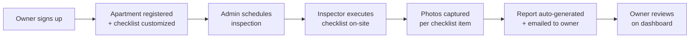
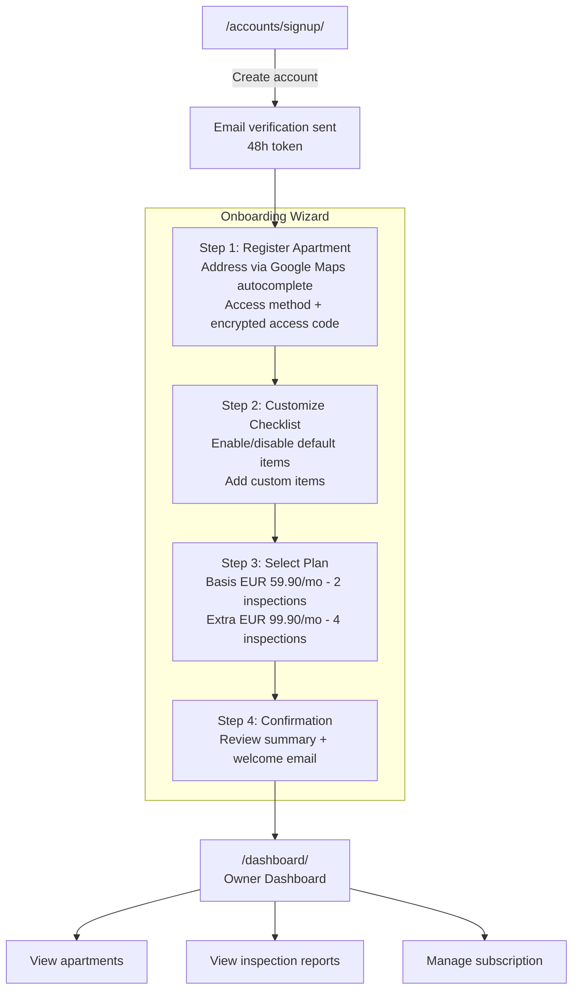
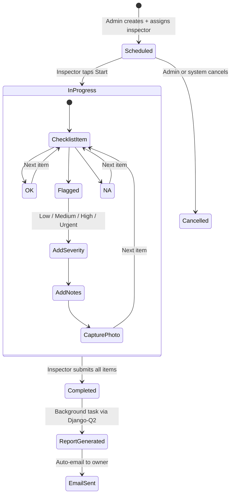

# BAKY

**Betreuung. Absicherung. Kontrolle. Your Home.**

Apartment monitoring and inspection platform for short-term rentals in Vienna.

## What is BAKY?

BAKY helps property owners maintain oversight of their short-term rental apartments between guest stays. We schedule professional inspections, execute checklist-based walkthroughs with photo documentation, and deliver instant reports.

## Business Process

### How It Works



### User Roles and Access

| Role | How they join | Login | Landing page | What they do |
|------|--------------|-------|-------------|-------------|
| **Owner** | Self-signup at `/accounts/signup/` | `/accounts/login/` → `/dashboard/` | Owner Dashboard | Registers apartments, customizes checklists, selects plan, views inspection reports |
| **Inspector** | Created by Admin in Django Admin | `/accounts/login/` → `/inspector/` | Inspector Schedule | Views daily assignments, executes checklists on-site, captures photos, submits inspections |
| **Admin** | `make createsuperuser` | `/accounts/login/` → `/admin/` | Django Admin | Manages users, schedules inspections, assigns inspectors, monitors platform |

All roles share a single login page. After login, users are redirected based on their role.

### Owner Journey (Signup to Reports)



### Inspection Lifecycle



### Overall Rating

| Rating | Meaning | Trigger |
|--------|---------|---------|
| **OK** | All good | All items OK or N/A |
| **Attention** | Some issues | Any item flagged with low/medium severity |
| **Urgent** | Critical issues | Any item flagged with high/urgent severity |

## URL Map

| Area | URL | Auth | Description |
|------|-----|------|-------------|
| **Public** | `/` | -- | Landing page |
| | `/preise/` | -- | Pricing |
| | `/impressum/` | -- | Legal notice |
| | `/datenschutz/` | -- | Privacy policy |
| | `/agb/` | -- | Terms of service |
| **Auth** | `/accounts/login/` | -- | Login (all roles) |
| | `/accounts/signup/` | -- | Owner self-signup |
| | `/accounts/verify/<token>/` | -- | Email verification |
| | `/accounts/onboarding/*` | Owner | 4-step onboarding wizard |
| | `/accounts/password-reset/` | -- | Password reset flow |
| **Dashboard** | `/dashboard/` | Owner | Apartment list, reports, subscription |
| **Inspector** | `/inspector/` | Inspector | Daily schedule, checklist execution |
| **Admin** | `/admin/` | Admin | Full platform management |

## Plans and Pricing

| Feature | Basis (EUR 59.90/mo) | Extra (EUR 99.90/mo) |
|---------|---------------------|---------------------|
| Inspections per month | 2 | 4 |
| Photo documentation | Yes | Yes |
| Instant reports | Yes | Yes |
| Custom checklist | Yes | Yes |
| Priority scheduling | -- | Yes |

## Quick Start

```bash
# Prerequisites: Docker only
cp .env.example .env
make up
make migrate
make seed
# Visit http://localhost:8000
```

## Development

This project is built with Claude Code. See [CLAUDE.md](CLAUDE.md) for conventions, architecture, and workflow.

### Key Make Targets

```bash
make up              # Start all services
make down            # Stop all services
make test            # Run pytest suite
make lint            # Run ruff + djlint
make migrate         # Run migrations
make seed            # Load demo/seed data
make shell           # Django shell
make createsuperuser # Create admin user
```

### Custom Skills

| Skill | Description |
|-------|------------|
| `/next-issue` | Pick the next issue from the roadmap |
| `/done-issue` | Complete current issue (verify, commit, PR, close) |
| `/baky-status` | Quick project status overview |
| `/validate` | Run full validation suite (lint + tests + e2e) |
| `/autopilot` | Start Ralph Loop for autonomous MVP development |

### Roadmap

See [Issue #44](https://github.com/robert197/baky/issues/44) for the full build order with dependencies.

**Build phases:**
1. **Foundation** -- Django project, Docker, testing, design system (done)
2. **Data Layer** -- Models, auth, checklists, storage, admin (done)
3. **Public Website** -- Landing, pricing, legal, signup/onboarding (done, Google Maps in progress)
4. **Inspector App** -- Scheduling, daily view, checklist execution, photo capture, submission
5. **Reports** -- Auto-generation from inspection data, email delivery
6. **Owner Dashboard** -- Apartment list, inspection timeline, subscription management
7. **Compliance and Launch** -- GDPR, seed data, CI/CD, production deployment

## Tech Stack

Django 5.x + HTMX + Alpine.js + Tailwind CSS + PostgreSQL -- all running in Docker.

| Layer | Technology |
|-------|-----------|
| Backend | Django 5.x (Python 3.12) |
| Frontend | Django Templates + HTMX + Alpine.js |
| Styling | Tailwind CSS |
| Database | PostgreSQL 16 |
| File Storage | AWS S3 / Cloudflare R2 |
| Background Tasks | Django-Q2 |
| Email | Resend |
| Admin | Django Admin + django-unfold |
| Hosting | Docker everywhere |

## License

Proprietary. All rights reserved.
