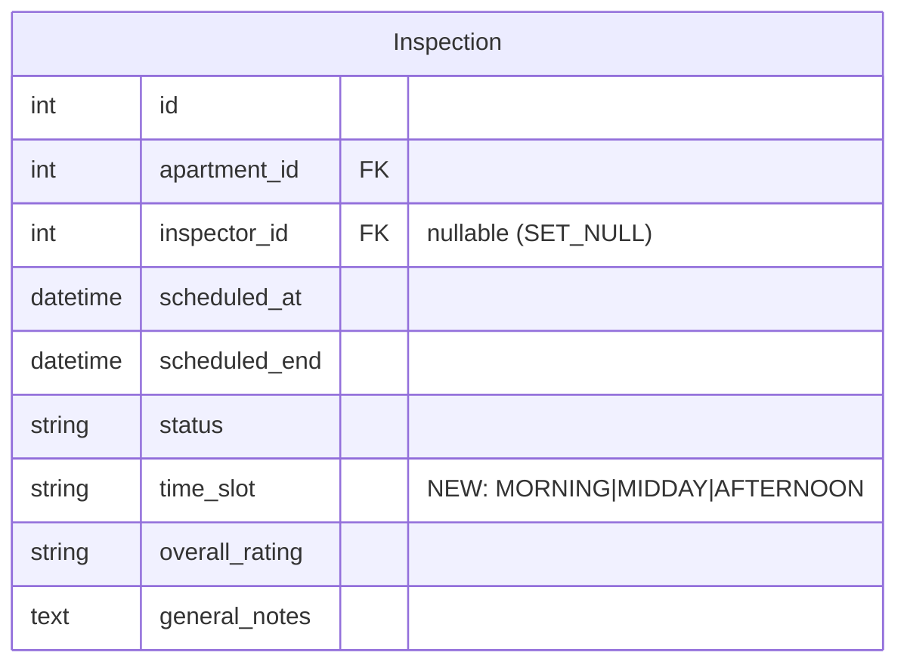

# Owner Calendar Booking with Fixed Time Slots

## Overview

Implement an owner-facing calendar booking system in the dashboard so owners can self-service schedule inspection appointments. The calendar shows a weekly grid with 3 fixed daily time slots (Vormittag, Mittag, Nachmittag) within 08:00-16:00 business hours, 7 days/week. Owners select an apartment and an available slot, and the system creates a SCHEDULED inspection (without inspector assignment — admin assigns later).

Closes #66.

## Problem Statement / Motivation

Currently, inspection scheduling is admin-only via Django Admin. The first customer feedback (2026-04-01) explicitly requested: "Ich brauche auch einen Kalender, dass die die Termine buchen kann — von 8 bis 16:00 Uhr, drei Termine pro Tag, sieben Tage die Woche."

This is a critical usability gap — owners cannot self-schedule, creating friction and dependency on admin response time.

## Proposed Solution

### Time Slot System

Three fixed daily slots:

| Slot | Name | Start | End | Duration |
|------|------|-------|-----|----------|
| MORNING | Vormittag | 08:00 | 10:30 | 2.5h |
| MIDDAY | Mittag | 10:30 | 13:00 | 2.5h |
| AFTERNOON | Nachmittag | 13:30 | 16:00 | 2.5h |

- 30-minute break between Mittag and Nachmittag (inspector lunch)
- Business hours changed from 8-18 to 8-16
- 7 days/week including weekends

### Booking Flow

1. Owner clicks "Termin buchen" in sidebar/bottom nav
2. Selects apartment from dropdown (filtered to ACTIVE apartments)
3. Sees weekly calendar (Monday-first, Austrian convention)
4. Available slots: green. Full slots: gray. Past slots: dimmed.
5. Clicks available slot → inline HTMX confirmation panel
6. Confirms → Inspection created (SCHEDULED, no inspector)
7. Success message + calendar refreshes
8. Admin receives email notification to assign inspector

### Key Design Decisions

1. **Inspector FK nullable**: Make `inspector` field `null=True, blank=True, on_delete=SET_NULL`. Audit all code that accesses `inspection.inspector` for None safety.
2. **Subscription counting fix**: Update `get_inspections_used_this_month()` to count all non-cancelled inspections (SCHEDULED + IN_PROGRESS + COMPLETED), matching `_check_subscription_limit()` behavior.
3. **Inspector availability**: Purely computed from existing Inspection records. No JSONField schema needed for MVP.
4. **No hard cap on bookings per slot**: Allow unlimited bookings (admin assigns inspectors later). Simple for MVP.
5. **24-hour advance booking**: Cannot book slots less than 24 hours from now.
6. **Week starts Monday**: Austrian convention.
7. **Mobile layout**: Vertical day-by-day list on mobile (<768px), 7-column grid on desktop.
8. **Apartment-level duplicate prevention**: No two inspections for the same apartment on the same day.

## Technical Approach

### Architecture



### Files to Modify

| File | Changes |
|------|---------|
| `apps/inspections/models.py` | Change BUSINESS_HOURS_END, add TimeSlot, add time_slot field, make inspector nullable, add apartment-day duplicate check |
| `apps/accounts/models.py` | Fix `get_inspections_used_this_month()` to count non-cancelled |
| `apps/dashboard/views.py` | Add `booking_calendar` and `book_slot` views |
| `apps/dashboard/forms.py` | Add `BookingForm` |
| `apps/dashboard/urls.py` | Add booking URL routes |
| `apps/dashboard/tasks.py` | Add `send_booking_notification` task |
| `templates/components/_sidebar.html` | Add "Termin buchen" link |
| `templates/components/_owner_bottom_nav.html` | Add booking nav item |
| `templates/dashboard/booking_calendar.html` | Weekly calendar page |
| `templates/dashboard/_calendar_week.html` | HTMX partial for week navigation |
| `templates/dashboard/_booking_confirm.html` | HTMX confirmation panel |
| `templates/emails/admin_booking.html` | Admin notification email (HTML) |
| `templates/emails/admin_booking.txt` | Admin notification email (text) |
| `apps/inspections/admin.py` | Handle nullable inspector in CSV export + list display |
| `tests/factories.py` | Update InspectionFactory for nullable inspector |

### Implementation Phases

#### Phase 1: Model Changes & Migration

**Task 1.1: Change business hours and add TimeSlot**

Update `apps/inspections/models.py`:
- Change `BUSINESS_HOURS_END = 18` → `BUSINESS_HOURS_END = 16`
- Add `TimeSlot` TextChoices to `Inspection`:
  ```python
  class TimeSlot(models.TextChoices):
      MORNING = "morning", "Vormittag (08:00–10:30)"
      MIDDAY = "midday", "Mittag (10:30–13:00)"
      AFTERNOON = "afternoon", "Nachmittag (13:30–16:00)"
  ```
- Add `SLOT_TIMES` dict mapping each slot to `(start_hour, start_minute, end_hour, end_minute)`:
  ```python
  SLOT_TIMES = {
      TimeSlot.MORNING: (8, 0, 10, 30),
      TimeSlot.MIDDAY: (10, 30, 13, 0),
      TimeSlot.AFTERNOON: (13, 30, 16, 0),
  }
  ```
- Add `time_slot` field: `CharField(max_length=20, choices=TimeSlot.choices, blank=True)`

Tests (`tests/inspections/test_scheduling.py`):
- Update `test_end_at_exactly_18_accepted` → `test_end_at_exactly_16_accepted` (hour=14, end=16)
- Update `test_start_at_18_rejected` → `test_start_at_16_rejected` (hour=16)
- Update `test_business_hours_error_message_contains_times` to check for "16"
- Update all tests that schedule at hour=14-17 to use valid hours
- Add `test_time_slot_choices_exist`
- Add `test_slot_times_mapping_complete`

**Task 1.2: Make inspector nullable**

Update `apps/inspections/models.py`:
```python
inspector = models.ForeignKey(
    settings.AUTH_USER_MODEL,
    on_delete=models.SET_NULL,
    related_name="inspections",
    limit_choices_to={"role": "inspector"},
    null=True,
    blank=True,
)
```

Update `Inspection.clean()`:
- The double-booking check at line 86 already guards with `if self.inspector_id`, so it safely skips when inspector is None.

Add apartment-day duplicate validation:
```python
# Validate no same-apartment same-day booking
if self.apartment_id and self.scheduled_at:
    local_date = timezone.localtime(self.scheduled_at).date()
    same_day = Inspection.objects.filter(
        apartment=self.apartment,
        scheduled_at__date=local_date,
        status__in=[self.Status.SCHEDULED, self.Status.IN_PROGRESS, self.Status.COMPLETED],
    )
    if self.pk:
        same_day = same_day.exclude(pk=self.pk)
    if same_day.exists():
        errors["scheduled_at"] = "Für diese Wohnung ist an diesem Tag bereits eine Inspektion geplant."
```

Audit inspector references for None safety:
- `apps/inspections/admin.py:95` — guard with `if inspection.inspector else "Nicht zugewiesen"`
- `apps/inspections/tasks.py:66-76` — guard email sending with `if inspection.inspector`
- `apps/reports/tasks.py:103` — guard with `inspection.inspector` or empty string
- Templates: use `...` guards
- Inspector views (`apps/inspections/views.py:101,112,208,266,391`) — already use `inspector_id` checks, safe

Create migration: `make makemigrations`

Tests:
- `test_inspection_without_inspector_valid` — create inspection with `inspector=None`, call `clean()`, should pass
- `test_same_apartment_same_day_rejected` — book two inspections for same apartment on same day
- `test_same_apartment_different_day_accepted`
- `test_different_apartment_same_day_accepted`
- `test_admin_csv_export_with_no_inspector` — exercise CSV export with nullable inspector

**Task 1.3: Fix subscription usage counting**

Update `apps/accounts/models.py` `get_inspections_used_this_month()`:
```python
def get_inspections_used_this_month(self) -> int:
    """Return the number of non-cancelled inspections this month across all owner apartments."""
    from apps.inspections.models import Inspection

    today = date.today()
    return Inspection.objects.filter(
        apartment__owner=self.owner,
        status__in=[Inspection.Status.SCHEDULED, Inspection.Status.IN_PROGRESS, Inspection.Status.COMPLETED],
        scheduled_at__year=today.year,
        scheduled_at__month=today.month,
    ).count()
```

Tests (`tests/accounts/test_models.py` or `tests/dashboard/test_subscription_views.py`):
- `test_get_inspections_used_counts_scheduled` — scheduled inspections count toward usage
- `test_get_inspections_used_excludes_cancelled` — cancelled inspections don't count
- `test_get_inspections_used_counts_all_statuses` — SCHEDULED + IN_PROGRESS + COMPLETED all count

#### Phase 2: Booking Views & Forms

**Task 2.1: Add BookingForm**

Add to `apps/dashboard/forms.py`:
```python
class BookingApartmentForm(forms.Form):
    apartment = forms.ModelChoiceField(
        queryset=Apartment.objects.none(),
        label="Wohnung",
        widget=forms.Select(attrs={"class": INPUT_CSS}),
    )

    def __init__(self, *args, owner=None, **kwargs):
        super().__init__(*args, **kwargs)
        if owner:
            self.fields["apartment"].queryset = Apartment.objects.filter(
                owner=owner, status=Apartment.Status.ACTIVE
            )
```

Tests (`tests/dashboard/test_forms.py`):
- `test_booking_form_filters_active_apartments`
- `test_booking_form_excludes_other_owners_apartments`
- `test_booking_form_excludes_paused_apartments`

**Task 2.2: Add slot availability helper**

Add to `apps/dashboard/views.py` (or a dedicated `apps/dashboard/services.py`):
```python
def get_week_availability(start_date, apartment, owner):
    """Return availability data for a 7-day week starting at start_date."""
    from apps.inspections.models import Inspection

    subscription = _get_subscription_or_none(owner)
    if not subscription or subscription.status != Subscription.Status.ACTIVE:
        return {"slots": [], "limit_reached": True, "used": 0, "limit": 0}

    used = subscription.get_inspections_used_this_month()
    limit = subscription.get_monthly_inspection_limit()
    limit_reached = used >= limit

    days = []
    for day_offset in range(7):
        current_date = start_date + timedelta(days=day_offset)
        day_slots = []
        for slot_key, (sh, sm, eh, em) in Inspection.SLOT_TIMES.items():
            slot_start = datetime(current_date.year, current_date.month, current_date.day, sh, sm, tzinfo=VIENNA_TZ)
            slot_end = datetime(current_date.year, current_date.month, current_date.day, eh, em, tzinfo=VIENNA_TZ)

            is_past = timezone.now() >= slot_start - timedelta(hours=24)
            has_booking = Inspection.objects.filter(
                apartment=apartment,
                scheduled_at__date=current_date,
                status__in=[Inspection.Status.SCHEDULED, Inspection.Status.IN_PROGRESS, Inspection.Status.COMPLETED],
            ).exists() if not is_past else False

            day_slots.append({
                "key": slot_key,
                "label": Inspection.TimeSlot(slot_key).label,
                "start": f"{sh:02d}:{sm:02d}",
                "end": f"{eh:02d}:{em:02d}",
                "available": not is_past and not has_booking and not limit_reached,
                "is_past": is_past,
                "has_booking": has_booking,
            })
        days.append({"date": current_date, "slots": day_slots})

    return {"days": days, "used": used, "limit": limit, "limit_reached": limit_reached}
```

Tests (`tests/dashboard/test_views.py`):
- `test_week_availability_shows_7_days`
- `test_week_availability_3_slots_per_day`
- `test_past_slots_not_available`
- `test_booked_apartment_slot_not_available`
- `test_limit_reached_all_slots_unavailable`
- `test_different_apartment_same_day_available`

**Task 2.3: Add booking_calendar view**

Add to `apps/dashboard/views.py`:
```python
@owner_required
def booking_calendar(request):
    subscription = _get_subscription_or_none(request.user)
    if not subscription or subscription.status != Subscription.Status.ACTIVE:
        messages.warning(request, "Terminbuchung ist nur mit einem aktiven Abonnement möglich.")
        return redirect("dashboard:subscription")

    form = BookingApartmentForm(request.GET or None, owner=request.user)
    apartments = Apartment.objects.filter(owner=request.user, status=Apartment.Status.ACTIVE)

    if not apartments.exists():
        messages.info(request, "Bitte fügen Sie zuerst eine Wohnung hinzu.")
        return redirect("dashboard:index")

    # Parse week offset for navigation
    try:
        week_offset = int(request.GET.get("week", 0))
    except (ValueError, TypeError):
        week_offset = 0
    week_offset = max(0, week_offset)  # No past weeks

    today = date.today()
    # Start of current week (Monday)
    start_of_week = today - timedelta(days=today.weekday()) + timedelta(weeks=week_offset)

    # Selected apartment
    selected_apartment = None
    if request.GET.get("apartment"):
        selected_apartment = get_object_or_404(
            Apartment, pk=request.GET["apartment"], owner=request.user, status=Apartment.Status.ACTIVE
        )

    availability = None
    if selected_apartment:
        availability = get_week_availability(start_of_week, selected_apartment, request.user)

    context = {
        "form": form,
        "apartments": apartments,
        "selected_apartment": selected_apartment,
        "availability": availability,
        "week_offset": week_offset,
        "start_of_week": start_of_week,
        "active": "booking",
    }

    if request.headers.get("HX-Request"):
        return render(request, "dashboard/_calendar_week.html", context)
    return render(request, "dashboard/booking_calendar.html", context)
```

Tests (`tests/dashboard/test_booking_views.py`):
- `test_booking_calendar_requires_login` — 302 redirect
- `test_booking_calendar_requires_owner_role` — 404 for inspector
- `test_booking_calendar_requires_active_subscription` — redirects with warning
- `test_booking_calendar_requires_apartments` — redirects if no apartments
- `test_booking_calendar_renders_successfully` — 200 with apartment and subscription
- `test_booking_calendar_shows_apartment_selector`
- `test_booking_calendar_week_navigation_htmx` — HX-Request returns partial
- `test_booking_calendar_no_past_weeks` — week_offset clamped to 0

**Task 2.4: Add book_slot view**

Add to `apps/dashboard/views.py`:
```python
@owner_required
def book_slot(request):
    if request.method != "POST":
        return HttpResponseNotAllowed(["POST"])

    subscription = _get_subscription_or_none(request.user)
    if not subscription or subscription.status != Subscription.Status.ACTIVE:
        return render(request, "dashboard/_booking_error.html", {
            "error": "Terminbuchung ist nur mit einem aktiven Abonnement möglich."
        })

    apartment_id = request.POST.get("apartment")
    slot_date = request.POST.get("date")
    slot_key = request.POST.get("slot")

    apartment = get_object_or_404(Apartment, pk=apartment_id, owner=request.user, status=Apartment.Status.ACTIVE)

    # Validate slot
    if slot_key not in Inspection.SLOT_TIMES:
        return render(request, "dashboard/_booking_error.html", {"error": "Ungültiger Zeitslot."})

    target_date = date.fromisoformat(slot_date)
    sh, sm, eh, em = Inspection.SLOT_TIMES[slot_key]
    scheduled_at = datetime(target_date.year, target_date.month, target_date.day, sh, sm, tzinfo=VIENNA_TZ)
    scheduled_end = datetime(target_date.year, target_date.month, target_date.day, eh, em, tzinfo=VIENNA_TZ)

    # 24-hour advance check
    if timezone.now() >= scheduled_at - timedelta(hours=24):
        return render(request, "dashboard/_booking_error.html", {
            "error": "Buchungen müssen mindestens 24 Stunden im Voraus erfolgen."
        })

    inspection = Inspection(
        apartment=apartment,
        inspector=None,
        scheduled_at=scheduled_at,
        scheduled_end=scheduled_end,
        time_slot=slot_key,
        status=Inspection.Status.SCHEDULED,
    )

    try:
        inspection.full_clean()
        inspection.save()
    except ValidationError as e:
        error_msg = ". ".join(msg for msgs in e.message_dict.values() for msg in msgs)
        return render(request, "dashboard/_booking_error.html", {"error": error_msg})

    # Notify admin
    from baky.tasks import queue_task
    queue_task(
        "apps.dashboard.tasks.send_booking_notification",
        request.user.pk,
        inspection.pk,
        task_name=f"booking_notification_{inspection.pk}",
    )

    return render(request, "dashboard/_booking_success.html", {
        "inspection": inspection,
        "apartment": apartment,
    })
```

Tests (`tests/dashboard/test_booking_views.py`):
- `test_book_slot_creates_inspection` — POST with valid data creates Inspection
- `test_book_slot_requires_post` — GET returns 405
- `test_book_slot_requires_owner` — 302/404 for unauthenticated/inspector
- `test_book_slot_requires_active_subscription`
- `test_book_slot_rejects_past_date`
- `test_book_slot_rejects_24h_advance`
- `test_book_slot_rejects_same_apartment_same_day`
- `test_book_slot_rejects_invalid_slot`
- `test_book_slot_rejects_over_subscription_limit`
- `test_book_slot_sets_time_slot_field`
- `test_book_slot_notifies_admin` — check task queued
- `test_book_slot_scopes_to_owner_apartments` — cannot book another owner's apartment

#### Phase 3: URL Routes & Navigation

**Task 3.1: Add URL routes**

Update `apps/dashboard/urls.py`:
```python
# Booking
path("buchen/", views.booking_calendar, name="booking_calendar"),
path("buchen/slot/", views.book_slot, name="book_slot"),
```

**Task 3.2: Update sidebar and bottom nav**

Update `templates/components/_sidebar.html` — replace the disabled "Inspektionen" placeholder with an active "Termin buchen" link:
```html
<a href=""
   class="flex items-center gap-3 rounded-lg px-3 py-2 text-sm bg-surface font-medium text-primarytext-secondary hover:bg-surface hover:text-primary">
  <svg class="h-5 w-5" fill="none" viewBox="0 0 24 24" stroke="currentColor">
    <path stroke-linecap="round" stroke-linejoin="round" stroke-width="2" d="M8 7V3m8 4V3m-9 8h10M5 21h14a2 2 0 002-2V7a2 2 0 00-2-2H5a2 2 0 00-2 2v12a2 2 0 002 2z" />
  </svg>
  Termin buchen
</a>
```

Similarly update `templates/components/_owner_bottom_nav.html` — replace the disabled "Berichte" placeholder with booking link.

#### Phase 4: Templates

**Task 4.1: Create booking_calendar.html**

Main calendar page extending `dashboard/base_dashboard.html`:
- Page title: "Termin buchen"
- Apartment selector dropdown (auto-submits via HTMX `hx-get` on change)
- Subscription usage indicator: "2/4 Inspektionen diesen Monat gebucht"
- Week navigation arrows (previous/next) with HTMX
- Calendar grid (includes `_calendar_week.html`)

**Task 4.2: Create _calendar_week.html**

HTMX partial for the weekly calendar:
- Desktop (>=768px): 7-column grid, one column per day (Mon-Sun)
- Mobile (<768px): Vertical stack, one card per day
- Each day shows date header + 3 slot buttons
- Slot states: available (green/emerald), booked (gray), past (dimmed)
- Clicking available slot → `hx-post` to `/dashboard/buchen/slot/` with confirmation

**Task 4.3: Create _booking_confirm.html, _booking_success.html, _booking_error.html**

HTMX response partials:
- Confirm: Shows apartment, date, time slot, "Bestätigen" button
- Success: Green checkmark, "Inspektion geplant" message, details
- Error: Red alert with error message, "Zurück" link

#### Phase 5: Admin Notification

**Task 5.1: Add booking notification task**

Add to `apps/dashboard/tasks.py`:
```python
def send_booking_notification(owner_id: int, inspection_id: int) -> None:
    """Send notification to admin when owner books an inspection."""
    from apps.inspections.models import Inspection

    owner = User.objects.get(pk=owner_id)
    inspection = Inspection.objects.select_related("apartment").get(pk=inspection_id)

    context = {
        "owner": owner,
        "inspection": inspection,
        "apartment": inspection.apartment,
    }

    subject = f"Neue Buchung — {inspection.apartment.address} ({inspection.get_time_slot_display()})"
    _send_email(subject, "emails/admin_booking", context, [settings.BAKY_ADMIN_EMAIL])
```

Create email templates:
- `templates/emails/admin_booking.html` — follows existing admin email pattern
- `templates/emails/admin_booking.txt` — plain text version

Tests (`tests/dashboard/test_tasks.py`):
- `test_send_booking_notification_sends_email`
- `test_send_booking_notification_includes_apartment_info`

## System-Wide Impact

### Interaction Graph

- Owner POSTs to `book_slot` → creates `Inspection` (triggers `Inspection.clean()` validation chain) → queues `send_booking_notification` background task → sends admin email
- `Inspection.clean()` calls `_check_subscription_limit()` which queries all non-cancelled inspections for the owner's month
- Making inspector nullable affects: CSV export in admin, email report tasks (guarded by `if inspection.inspector`), template rendering (guarded by ``)

### Error Propagation

- `ValidationError` from `Inspection.clean()` → caught in `book_slot` view → rendered as HTMX error partial
- `Subscription.DoesNotExist` → caught by `_get_subscription_or_none()` → redirect to subscription page
- Background task failure (email) → logged by Django-Q2, does not affect booking success

### State Lifecycle Risks

- No partial failure risk: Inspection is created in a single `save()` call. Email notification is async and independent.
- Stale calendar data: Handled by re-validating at booking time via `full_clean()`.

### API Surface Parity

- Admin can still create inspections with inspector assigned (existing flow unchanged)
- Owner books without inspector → admin assigns later via Django Admin
- Inspector schedule view already filters by `inspector_id`, unaffected by nullable FK

## Acceptance Criteria

### Functional Requirements
- [ ] Booking calendar accessible from dashboard sidebar and bottom nav
- [ ] Apartment selector filters to owner's ACTIVE apartments
- [ ] Weekly calendar shows 3 slots per day, 7 days/week
- [ ] Slot availability reflects existing bookings and subscription limits
- [ ] Subscription usage indicator shows "X/Y Inspektionen diesen Monat"
- [ ] Week navigation (next/previous) works via HTMX
- [ ] Booking creates Inspection with SCHEDULED status and no inspector
- [ ] Admin receives email notification for new bookings
- [ ] 24-hour advance booking enforced
- [ ] Same apartment same day duplicate prevented
- [ ] Past slots not bookable
- [ ] Mobile-responsive layout (vertical on mobile, grid on desktop)

### Validation
- [ ] `make lint` passes
- [ ] `make test` passes (20+ new tests)
- [ ] `make manage CMD="check"` passes

## Dependencies & Risks

- **Migration risk**: Making `inspector` nullable requires careful audit of all 25+ references to `inspection.inspector`. Mitigated by systematic grep and test coverage.
- **Business hours change**: Updating `BUSINESS_HOURS_END` from 18→16 will break 3+ existing tests. These must be updated in the same task.
- **Subscription counting fix**: Changes `get_inspections_used_this_month()` behavior which is displayed in subscription cards. The new behavior (counting all non-cancelled) is more accurate.

## Sources & References

- Related issue: #66
- Customer feedback: 2026-04-01 (documented in #44 roadmap)
- Dependencies: #16 (dashboard), #27 (scheduling), #65 (pricing restructure) — all closed
- Existing patterns: `apps/dashboard/views.py` (subscription views), `apps/inspections/models.py` (scheduling validation)
- Learnings: `docs/solutions/runtime-errors/django-reverse-onetoone-relatedobjectdoesnotexist-in-templates.md` — use `_get_subscription_or_none()` helper, never access reverse OneToOneField directly in templates
