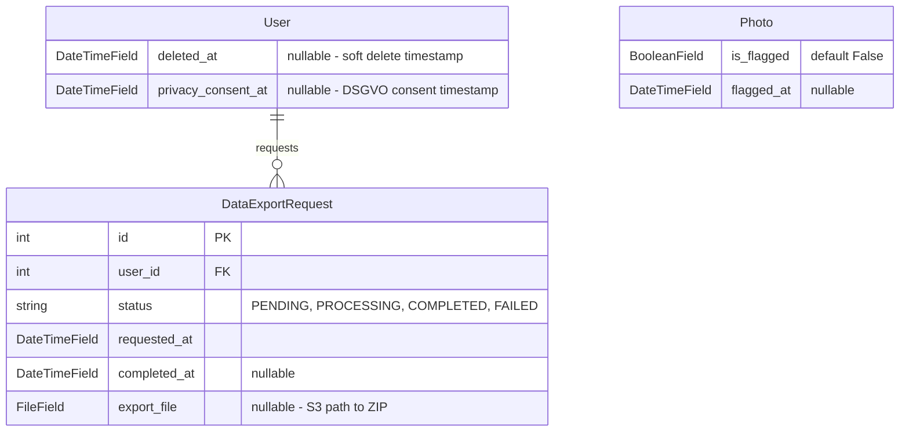

# feat: GDPR compliance for inspection data and photos

## Overview

Implement GDPR (DSGVO) compliance for BAKY's data handling, covering photo retention policies,
data export (Auskunftsrecht), account deletion (Recht auf Loeschung), cookie consent,
and EU-region storage configuration. This ensures BAKY meets Austrian/EU data protection requirements
before production launch.

## Problem Statement / Motivation

BAKY handles sensitive personal data: apartment access codes, inspection photos, owner contact details.
GDPR compliance is a legal requirement for operating in the EU. Without it:
- Photos accumulate indefinitely in S3 (storage cost + data minimization violation)
- Owners have no mechanism to exercise their DSGVO rights (Art. 15-17)
- No transparency about data handling practices
- Risk of regulatory penalties

## Proposed Solution

Implement GDPR compliance in 7 focused tasks:

1. **S3 region configuration** - Ensure EU data residency
2. **Photo retention model changes** - Add `is_flagged` field, `cleanup_expired_photos` command
3. **S3 file cleanup signals** - Delete S3 objects when Photo records are deleted
4. **Account soft-delete** - Add `deleted_at` to User, deletion request flow, `purge_deleted_accounts` command
5. **Data export** - Owner self-service export request, admin action, background ZIP generation
6. **Cookie consent banner** - Informational banner (technical cookies only, no consent required)
7. **Privacy pages and registration notice** - Update datenschutz/AGB placeholders, add consent checkbox to signup

## Key Design Decisions

### Soft-Delete Strategy
- Add `deleted_at = DateTimeField(null=True)` to `User` model
- Set `is_active = False` when deletion requested (blocks normal login)
- Dedicated reversal URL with password re-entry for cancellation during 30-day grace period
- `purge_deleted_accounts` hard-deletes users where `deleted_at < now - 30 days`

### S3 File Cleanup
- `post_delete` signal on `Photo` model deletes both `file` and `thumbnail` from S3
- For bulk operations (account purge), collect all S3 paths first, then delete DB records (CASCADE), then batch-delete S3 objects
- This prevents orphaned S3 files

### Photo Flagging
- Per-photo granularity (`is_flagged` boolean on Photo model)
- When unflagged, 90-day clock restarts from unflag date (store `flagged_at`)
- Cleanup command checks: `created_at < 90 days ago AND NOT is_flagged` OR `flagged_at is not null AND flagged_at < 90 days ago AND NOT is_flagged`

### Active Inspections During Deletion
- Block deletion if any inspection is `IN_PROGRESS` (show error message)
- Auto-cancel `SCHEDULED` inspections on deletion request

### Data Export
- Self-service "Daten exportieren" button in dashboard
- Creates `DataExportRequest` record, queues Django-Q2 task
- Admin action to generate export for selected users
- Export includes: User profile, Apartments, Inspections, Items, Reports as JSON
- Photos included as signed URLs (7-day expiry), not embedded files (keeps export manageable)
- Encrypted fields (`access_code`, `access_notes`) exported in decrypted form (owner's own data)
- Export ZIP stored in S3, download link sent via email

### Cookie Banner
- Informational only (BAKY uses only technical cookies: session + CSRF)
- No consent mechanism needed under ePrivacy Directive
- Dismiss state stored in localStorage
- Alpine.js component in `base.html`

### Registration Privacy Notice
- Add checkbox to signup form: "Ich stimme der Datenschutzerklaerung und den AGB zu"
- Store `privacy_consent_at` timestamp on User model
- Link to `/datenschutz/` and `/agb/`

## Technical Considerations

### Architecture
- New model: `DataExportRequest` in `apps/accounts/models.py`
- New fields on `User`: `deleted_at`, `privacy_consent_at`
- New field on `Photo`: `is_flagged`, `flagged_at`
- Two new management commands in respective apps
- Two new Django-Q2 scheduled tasks
- New dashboard views for export/deletion
- Signal for S3 cleanup

### Performance
- Photo cleanup command uses `select_related` and batch deletes
- Data export runs as background task (can be large)
- S3 batch delete API for bulk operations (up to 1000 objects per request)

### Security
- Account deletion requires password re-entry confirmation
- Export download link is signed URL with 7-day expiry
- Deletion reversal requires password re-entry

## System-Wide Impact

### Interaction Graph
- Account deletion: User.delete() -> CASCADE to Apartments -> CASCADE to Inspections -> CASCADE to Photos/Items/Reports
- Photo post_delete signal -> S3 file deletion (both file and thumbnail)
- Deletion request -> cancel SCHEDULED inspections -> notify inspectors
- Export request -> Django-Q2 task -> gather data -> generate ZIP -> upload to S3 -> email owner

### Error Propagation
- S3 deletion failure should NOT block DB deletion (log error, orphaned files cleaned up later)
- Export generation failure -> mark DataExportRequest as FAILED, notify admin
- Purge command: if S3 batch delete partially fails, log and continue

### State Lifecycle Risks
- Soft-deleted user with `is_active=False`: Django admin must still show these users
- Data export for soft-deleted user: export task must use `User.objects.all()` not `User.objects.filter(is_active=True)`
- Photo flagging: if inspection is deleted, flagged photos are also deleted (CASCADE)

### API Surface Parity
- Dashboard views: add export/deletion endpoints
- Admin actions: add export generation
- Management commands: add cleanup_expired_photos, purge_deleted_accounts
- Templates: update datenschutz, agb, add cookie banner, update signup form

## ERD Changes



## Acceptance Criteria

- [ ] S3 storage configured with `eu-central-1` region
- [ ] Photo model has `is_flagged` and `flagged_at` fields
- [ ] `cleanup_expired_photos` command deletes photos older than 90 days (unflagged)
- [ ] Cleanup command scheduled as daily Django-Q2 task
- [ ] S3 files (file + thumbnail) deleted when Photo record is deleted
- [ ] User model has `deleted_at` and `privacy_consent_at` fields
- [ ] Owner can request account deletion from dashboard (with password confirmation)
- [ ] Soft-deleted accounts blocked from login (`is_active=False`)
- [ ] Owner can reverse deletion during 30-day grace period
- [ ] `purge_deleted_accounts` command hard-deletes expired soft-deleted accounts
- [ ] Owner can request data export from dashboard
- [ ] Admin action to generate data export for selected users
- [ ] Data export includes all owner data as JSON/ZIP
- [ ] Cookie consent banner shown on all pages (informational, dismissable)
- [ ] Datenschutz page updated with concrete retention periods
- [ ] AGB page content is current
- [ ] Signup form includes privacy/AGB consent checkbox
- [ ] All tests pass with minimum counts per feature type

## Implementation Tasks

### Task 1: S3 Region Configuration + Photo Retention Model Changes

**Files:**
- `baky/settings/production.py` - Add `AWS_S3_REGION_NAME`
- `apps/inspections/models.py` - Add `is_flagged`, `flagged_at` to Photo
- `apps/inspections/migrations/XXXX_add_photo_flagging_fields.py` - Auto-generated
- `tests/inspections/test_models.py` - Photo flagging tests

**Test first:**
```python
# tests/inspections/test_models.py
class TestPhotoFlagging:
    def test_photo_default_not_flagged(self, photo):
        assert photo.is_flagged is False
        assert photo.flagged_at is None

    def test_photo_flag(self, photo):
        photo.is_flagged = True
        photo.flagged_at = timezone.now()
        photo.save()
        photo.refresh_from_db()
        assert photo.is_flagged is True
        assert photo.flagged_at is not None

    def test_photo_unflag_clears_flagged_at(self, photo):
        photo.is_flagged = True
        photo.flagged_at = timezone.now()
        photo.save()
        photo.is_flagged = False
        photo.flagged_at = None
        photo.save()
        photo.refresh_from_db()
        assert photo.is_flagged is False
```

**Implementation:**
```python
# apps/inspections/models.py - Add to Photo model
is_flagged = models.BooleanField(default=False, help_text="Owner-flagged for retention beyond 90 days")
flagged_at = models.DateTimeField(null=True, blank=True, help_text="When the photo was flagged")
```

```python
# baky/settings/production.py - Add
AWS_S3_REGION_NAME = "eu-central-1"
```

**Verify:** `make test ARGS="-k test_photo_flag"`

---

### Task 2: S3 File Cleanup Signal

**Files:**
- `apps/inspections/signals.py` - New file, post_delete signal for Photo
- `apps/inspections/apps.py` - Register signal
- `tests/inspections/test_signals.py` - Signal tests

**Test first:**
```python
# tests/inspections/test_signals.py
from unittest.mock import patch, MagicMock

class TestPhotoDeleteSignal:
    @patch("apps.inspections.signals.default_storage")
    def test_photo_delete_removes_s3_files(self, mock_storage, photo):
        file_name = photo.file.name
        thumb_name = photo.thumbnail.name if photo.thumbnail else None
        photo.delete()
        mock_storage.delete.assert_any_call(file_name)
        if thumb_name:
            mock_storage.delete.assert_any_call(thumb_name)

    @patch("apps.inspections.signals.default_storage")
    def test_photo_delete_handles_missing_s3_file(self, mock_storage, photo):
        mock_storage.delete.side_effect = Exception("File not found")
        photo.delete()  # Should not raise

    @patch("apps.inspections.signals.default_storage")
    def test_photo_delete_without_thumbnail(self, mock_storage):
        photo = PhotoFactory(thumbnail="")
        file_name = photo.file.name
        photo.delete()
        mock_storage.delete.assert_called_once_with(file_name)
```

**Implementation:**
```python
# apps/inspections/signals.py
import logging
from django.core.files.storage import default_storage
from django.db.models.signals import post_delete
from django.dispatch import receiver
from apps.inspections.models import Photo

logger = logging.getLogger(__name__)

@receiver(post_delete, sender=Photo)
def delete_photo_files_from_storage(sender, instance, **kwargs):
    """Delete S3 files when a Photo record is deleted."""
    for field_name in ("file", "thumbnail"):
        field = getattr(instance, field_name, None)
        if field and field.name:
            try:
                default_storage.delete(field.name)
            except Exception:
                logger.warning("Failed to delete %s for Photo %s", field.name, instance.pk)
```

**Verify:** `make test ARGS="-k test_photo_delete"`

---

### Task 3: Photo Cleanup Management Command + Scheduled Task

**Files:**
- `apps/inspections/management/commands/cleanup_expired_photos.py` - New command
- `apps/inspections/tasks.py` - Add `cleanup_expired_photos` task
- `tests/inspections/test_commands.py` - Command tests
- `tests/inspections/test_tasks.py` - Task tests (if new task added)

**Test first:**
```python
# tests/inspections/test_commands.py
from django.core.management import call_command
from django.utils import timezone
from datetime import timedelta

class TestCleanupExpiredPhotos:
    def test_deletes_photos_older_than_90_days(self, db):
        old_photo = PhotoFactory(created_at=timezone.now() - timedelta(days=91))
        recent_photo = PhotoFactory(created_at=timezone.now() - timedelta(days=30))
        call_command("cleanup_expired_photos")
        assert not Photo.objects.filter(pk=old_photo.pk).exists()
        assert Photo.objects.filter(pk=recent_photo.pk).exists()

    def test_keeps_flagged_photos(self, db):
        old_flagged = PhotoFactory(
            created_at=timezone.now() - timedelta(days=91),
            is_flagged=True,
            flagged_at=timezone.now() - timedelta(days=10),
        )
        call_command("cleanup_expired_photos")
        assert Photo.objects.filter(pk=old_flagged.pk).exists()

    def test_deletes_unflagged_photos_past_90_days_since_unflag(self, db):
        """Photo was flagged then unflagged > 90 days ago."""
        photo = PhotoFactory(
            created_at=timezone.now() - timedelta(days=200),
            is_flagged=False,
            flagged_at=None,  # was unflagged
        )
        call_command("cleanup_expired_photos")
        assert not Photo.objects.filter(pk=photo.pk).exists()

    def test_dry_run_does_not_delete(self, db):
        old_photo = PhotoFactory(created_at=timezone.now() - timedelta(days=91))
        call_command("cleanup_expired_photos", "--dry-run")
        assert Photo.objects.filter(pk=old_photo.pk).exists()

    def test_outputs_deletion_count(self, db, capsys):
        PhotoFactory(created_at=timezone.now() - timedelta(days=91))
        PhotoFactory(created_at=timezone.now() - timedelta(days=91))
        call_command("cleanup_expired_photos")
        output = capsys.readouterr().out
        assert "2" in output
```

**Implementation:**
```python
# apps/inspections/management/commands/cleanup_expired_photos.py
from django.core.management.base import BaseCommand
from django.utils import timezone
from datetime import timedelta
from apps.inspections.models import Photo

class Command(BaseCommand):
    help = "Delete inspection photos older than 90 days that are not flagged by owner"

    def add_arguments(self, parser):
        parser.add_argument("--dry-run", action="store_true", help="Show what would be deleted without deleting")

    def handle(self, *args, **options):
        cutoff = timezone.now() - timedelta(days=90)
        expired = Photo.objects.filter(
            created_at__lt=cutoff,
            is_flagged=False,
        )
        count = expired.count()
        if options["dry_run"]:
            self.stdout.write(f"Would delete {count} expired photos (dry run)")
            return
        # Delete triggers post_delete signal which cleans up S3 files
        deleted, _ = expired.delete()
        self.stdout.write(self.style.SUCCESS(f"Deleted {deleted} expired photos"))
```

**Verify:** `make test ARGS="-k test_cleanup"`

---

### Task 4: Account Soft-Delete + Deletion Request Flow

**Files:**
- `apps/accounts/models.py` - Add `deleted_at`, `privacy_consent_at` to User
- `apps/accounts/migrations/XXXX_add_gdpr_fields.py` - Auto-generated
- `apps/dashboard/views.py` - Add `account_delete_request`, `account_delete_cancel` views
- `apps/dashboard/urls.py` - Add URL routes
- `templates/dashboard/account_delete.html` - Deletion confirmation page
- `templates/dashboard/account_delete_cancel.html` - Reversal confirmation
- `apps/accounts/management/commands/purge_deleted_accounts.py` - New command
- `tests/accounts/test_models.py` - Soft delete tests
- `tests/dashboard/test_views.py` - Deletion view tests
- `tests/accounts/test_commands.py` - Purge command tests

**Test first (model):**
```python
# tests/accounts/test_models.py
class TestUserSoftDelete:
    def test_user_default_no_deleted_at(self, owner):
        assert owner.deleted_at is None

    def test_user_soft_delete_sets_fields(self, owner):
        owner.deleted_at = timezone.now()
        owner.is_active = False
        owner.save()
        owner.refresh_from_db()
        assert owner.deleted_at is not None
        assert owner.is_active is False

    def test_user_cancel_deletion(self, owner):
        owner.deleted_at = timezone.now()
        owner.is_active = False
        owner.save()
        owner.deleted_at = None
        owner.is_active = True
        owner.save()
        owner.refresh_from_db()
        assert owner.deleted_at is None
        assert owner.is_active is True
```

**Test first (views):**
```python
# tests/dashboard/test_views.py
class TestAccountDeletion:
    def test_delete_request_requires_login(self, client):
        response = client.get("/dashboard/account/delete/")
        assert response.status_code == 302

    def test_delete_request_requires_owner_role(self, client, inspector):
        client.force_login(inspector)
        response = client.get("/dashboard/account/delete/")
        assert response.status_code == 404

    def test_delete_request_page_renders(self, client, owner):
        client.force_login(owner)
        response = client.get("/dashboard/account/delete/")
        assert response.status_code == 200

    def test_delete_request_requires_password(self, client, owner):
        client.force_login(owner)
        response = client.post("/dashboard/account/delete/", {"password": "wrong"})
        assert response.status_code == 200  # re-renders with error
        owner.refresh_from_db()
        assert owner.deleted_at is None

    def test_delete_request_success(self, client, owner):
        client.force_login(owner)
        response = client.post("/dashboard/account/delete/", {"password": "testpass123"})
        assert response.status_code == 302
        owner.refresh_from_db()
        assert owner.deleted_at is not None
        assert owner.is_active is False

    def test_delete_blocks_if_inspection_in_progress(self, client, owner):
        apartment = ApartmentFactory(owner=owner)
        InspectionFactory(apartment=apartment, status="IN_PROGRESS")
        client.force_login(owner)
        response = client.post("/dashboard/account/delete/", {"password": "testpass123"})
        assert response.status_code == 200  # re-renders with error
        owner.refresh_from_db()
        assert owner.deleted_at is None

    def test_delete_cancels_scheduled_inspections(self, client, owner):
        apartment = ApartmentFactory(owner=owner)
        inspection = InspectionFactory(apartment=apartment, status="SCHEDULED")
        client.force_login(owner)
        client.post("/dashboard/account/delete/", {"password": "testpass123"})
        inspection.refresh_from_db()
        assert inspection.status == "CANCELLED"
```

**Test first (purge command):**
```python
# tests/accounts/test_commands.py
class TestPurgeDeletedAccounts:
    def test_purges_expired_soft_deleted_accounts(self, db):
        user = OwnerFactory(deleted_at=timezone.now() - timedelta(days=31), is_active=False)
        call_command("purge_deleted_accounts")
        assert not User.objects.filter(pk=user.pk).exists()

    def test_keeps_recently_soft_deleted_accounts(self, db):
        user = OwnerFactory(deleted_at=timezone.now() - timedelta(days=15), is_active=False)
        call_command("purge_deleted_accounts")
        assert User.objects.filter(pk=user.pk).exists()

    def test_does_not_touch_active_accounts(self, db):
        user = OwnerFactory(is_active=True)
        call_command("purge_deleted_accounts")
        assert User.objects.filter(pk=user.pk).exists()

    def test_cascades_to_apartments_and_inspections(self, db):
        user = OwnerFactory(deleted_at=timezone.now() - timedelta(days=31), is_active=False)
        apartment = ApartmentFactory(owner=user)
        inspection = InspectionFactory(apartment=apartment)
        call_command("purge_deleted_accounts")
        assert not Apartment.objects.filter(pk=apartment.pk).exists()
        assert not Inspection.objects.filter(pk=inspection.pk).exists()

    def test_dry_run_does_not_purge(self, db):
        user = OwnerFactory(deleted_at=timezone.now() - timedelta(days=31), is_active=False)
        call_command("purge_deleted_accounts", "--dry-run")
        assert User.objects.filter(pk=user.pk).exists()
```

**Verify:** `make test ARGS="-k 'test_user_soft or test_account_delet or test_purge'"`

---

### Task 5: Data Export System

**Files:**
- `apps/accounts/models.py` - Add `DataExportRequest` model
- `apps/accounts/migrations/XXXX_add_data_export_request.py` - Auto-generated
- `apps/accounts/tasks.py` - New file, `generate_data_export` task
- `apps/accounts/admin.py` - Add admin action for export generation
- `apps/dashboard/views.py` - Add `data_export_request` view
- `apps/dashboard/urls.py` - Add URL route
- `templates/dashboard/data_export.html` - Export request page
- `templates/emails/data_export_ready.html` - Email notification
- `tests/accounts/test_models.py` - DataExportRequest tests
- `tests/accounts/test_tasks.py` - Export task tests
- `tests/dashboard/test_views.py` - Export view tests

**Test first (model):**
```python
class TestDataExportRequest:
    def test_create_export_request(self, owner):
        request = DataExportRequest.objects.create(user=owner)
        assert request.status == "PENDING"
        assert request.requested_at is not None

    def test_str_representation(self, owner):
        request = DataExportRequest.objects.create(user=owner)
        assert owner.email in str(request)

    def test_cascade_delete_with_user(self, owner):
        request = DataExportRequest.objects.create(user=owner)
        owner.delete()
        assert not DataExportRequest.objects.filter(pk=request.pk).exists()
```

**Test first (task):**
```python
class TestGenerateDataExport:
    def test_generates_json_export(self, owner):
        apartment = ApartmentFactory(owner=owner)
        export_req = DataExportRequest.objects.create(user=owner)
        result = generate_data_export(export_req.pk)
        export_req.refresh_from_db()
        assert export_req.status == "COMPLETED"
        assert result["status"] == "success"

    def test_export_includes_user_data(self, owner):
        export_req = DataExportRequest.objects.create(user=owner)
        generate_data_export(export_req.pk)
        export_req.refresh_from_db()
        # Verify ZIP content by reading the file
        assert export_req.export_file

    def test_export_handles_no_data(self, owner):
        export_req = DataExportRequest.objects.create(user=owner)
        result = generate_data_export(export_req.pk)
        assert result["status"] == "success"

    def test_export_marks_failed_on_error(self, owner):
        export_req = DataExportRequest.objects.create(user=owner)
        # Test with non-existent request ID
        result = generate_data_export(99999)
        assert result["status"] == "error"
```

**Test first (views):**
```python
class TestDataExportView:
    def test_export_request_requires_login(self, client):
        response = client.get("/dashboard/account/export/")
        assert response.status_code == 302

    def test_export_request_page_renders(self, client, owner):
        client.force_login(owner)
        response = client.get("/dashboard/account/export/")
        assert response.status_code == 200

    def test_export_request_creates_record(self, client, owner):
        client.force_login(owner)
        response = client.post("/dashboard/account/export/")
        assert response.status_code == 302
        assert DataExportRequest.objects.filter(user=owner).exists()

    def test_export_request_prevents_duplicates(self, client, owner):
        DataExportRequest.objects.create(user=owner, status="PENDING")
        client.force_login(owner)
        response = client.post("/dashboard/account/export/")
        assert DataExportRequest.objects.filter(user=owner).count() == 1
```

**Verify:** `make test ARGS="-k 'test_data_export or test_generate_data'"`

---

### Task 6: Cookie Consent Banner

**Files:**
- `templates/components/_cookie_banner.html` - New component
- `templates/base.html` - Include cookie banner
- `tests/public/test_views.py` - Banner presence tests

**Test first:**
```python
class TestCookieBanner:
    def test_cookie_banner_on_landing_page(self, client):
        response = client.get("/")
        assert response.status_code == 200
        content = response.content.decode()
        assert "cookie" in content.lower() or "Cookie" in content

    def test_cookie_banner_on_dashboard(self, client, owner):
        client.force_login(owner)
        response = client.get("/dashboard/")
        assert response.status_code == 200
        content = response.content.decode()
        assert "cookie" in content.lower() or "Cookie" in content
```

**Implementation:**
```html
<!-- templates/components/_cookie_banner.html -->
<div x-data="{ show: !localStorage.getItem('cookie_dismissed') }"
     x-show="show"
     x-transition
     class="fixed bottom-0 inset-x-0 z-50 p-4 bg-white border-t border-slate-200 shadow-lg"
     x-cloak>
  <div class="max-w-4xl mx-auto flex flex-col sm:flex-row items-center justify-between gap-4">
    <p class="text-sm text-slate-600">
      Diese Website verwendet ausschliesslich technisch notwendige Cookies (Session, CSRF).
      Weitere Informationen finden Sie in unserer
      <a href="/datenschutz/" class="text-amber-600 underline hover:text-amber-700">Datenschutzerklaerung</a>.
    </p>
    <button @click="show = false; localStorage.setItem('cookie_dismissed', '1')"
            class="shrink-0 px-4 py-2 bg-slate-800 text-white text-sm rounded-lg hover:bg-slate-700 transition-colors">
      Verstanden
    </button>
  </div>
</div>
```

**Verify:** `make test ARGS="-k test_cookie"`

---

### Task 7: Privacy Pages Update + Registration Consent

**Files:**
- `templates/public/datenschutz.html` - Update placeholders with concrete periods
- `templates/public/agb.html` - Review and update content
- `apps/accounts/forms.py` - Add privacy consent checkbox to SignupForm
- `apps/accounts/views.py` - Save consent timestamp on signup
- `templates/accounts/signup.html` - Add consent checkbox
- `tests/accounts/test_views.py` - Consent tests
- `tests/public/test_views.py` - Page content tests

**Test first:**
```python
# tests/accounts/test_views.py
class TestSignupPrivacyConsent:
    def test_signup_form_has_privacy_checkbox(self, client):
        response = client.get("/signup/")
        content = response.content.decode()
        assert "privacy_consent" in content or "datenschutz" in content.lower()

    def test_signup_requires_privacy_consent(self, client):
        response = client.post("/signup/", {
            "email": "test@example.com",
            "password1": "SecurePass123!",
            "password2": "SecurePass123!",
            "first_name": "Test",
            "last_name": "User",
            # privacy_consent NOT included
        })
        assert response.status_code == 200  # re-renders form with error

    def test_signup_with_consent_sets_timestamp(self, client):
        response = client.post("/signup/", {
            "email": "test@example.com",
            "password1": "SecurePass123!",
            "password2": "SecurePass123!",
            "first_name": "Test",
            "last_name": "User",
            "privacy_consent": True,
        })
        user = User.objects.get(email="test@example.com")
        assert user.privacy_consent_at is not None

# tests/public/test_views.py
class TestPrivacyPages:
    def test_datenschutz_has_retention_period(self, client):
        response = client.get("/datenschutz/")
        content = response.content.decode()
        assert "90" in content  # 90-day photo retention
        assert "30" in content  # 30-day deletion grace period

    def test_agb_page_renders(self, client):
        response = client.get("/agb/")
        assert response.status_code == 200
```

**Verify:** `make test ARGS="-k 'test_signup_privacy or test_datenschutz or test_agb'"`

---

## Dependencies & Risks

### Dependencies
- S3/R2 storage already configured (#9 - closed)
- Core models exist (#7 - closed)
- Django-Q2 background tasks work (#11 - closed)
- Public pages exist (#28 - closed)

### Risks
- **S3 file deletion failures**: Mitigated by logging + periodic orphan cleanup
- **Large data exports**: Mitigated by using signed URLs for photos instead of embedding
- **Race conditions in cleanup**: Low probability, acceptable for MVP
- **Legal compliance**: This is a technical implementation; actual legal texts should be reviewed by a lawyer before production

## Sources & References

### Internal References
- Photo model: `apps/inspections/models.py:207-252`
- User model: `apps/accounts/models.py`
- Storage utilities: `baky/storage.py`
- Task queue: `baky/tasks.py`
- Management command template: `apps/inspections/management/commands/send_inspection_reminders.py`
- Existing privacy page: `templates/public/datenschutz.html`
- Dashboard views: `apps/dashboard/views.py`

### Learnings Applied
- Never use HTML comments with template tags (use `{# #}`) - `docs/solutions/runtime-errors/django-template-tags-in-html-comments-recursion.md`
- Guard OneToOneField reverse access after deletion - `docs/solutions/runtime-errors/django-reverse-onetoone-relatedobjectdoesnotexist-in-templates.md`
