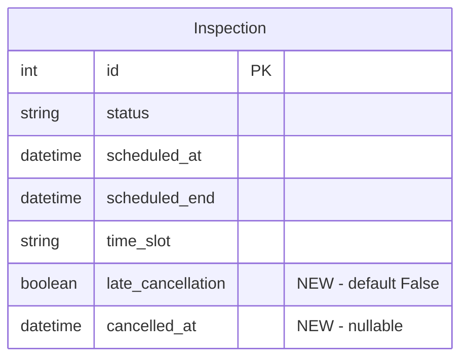

# Owner Booking Cancellation with 24h Policy

## Overview

Owners currently have no way to cancel booked inspections — only admins can via bulk action in Django Admin. This feature adds owner-facing cancellation with a 24-hour policy:

- **>=24h before slot start**: Cancel freely. Quota restored. Can rebook.
- **<24h before slot start**: Can still cancel, but visit counts as consumed. Quota NOT restored.

## Problem Statement

Owners who booked an inspection and need to change plans have no self-service option. They must contact admin. This creates friction and blocks the autonomous booking flow introduced in #66.

## Proposed Solution

1. Add `late_cancellation` and `cancelled_at` fields to Inspection model
2. New POST endpoint at `/dashboard/buchen/stornieren/<pk>/`
3. Add "Anstehende Termine" (upcoming appointments) section to booking calendar page with cancel buttons
4. HTMX-powered confirmation and cancellation flow
5. Update quota counting in both `Subscription.get_inspections_used_this_month()` and `Inspection._check_subscription_limit()`
6. Admin notification on cancellation

## Technical Approach

### Key Decisions

- **24h boundary**: `>=24h` = timely (quota restored), `<24h` = late (quota consumed). Exactly 24h = timely. Uses `timezone.now()` vs `inspection.scheduled_at - timedelta(hours=24)` — timezone-safe since both are UTC-aware.
- **Confirmation UI**: `hx-confirm` browser dialog showing dynamic text (which rule applies). Keeps it simple, consistent with existing booking confirmations.
- **Where cancel buttons live**: Add "Anstehende Termine" section below the calendar on the booking page. This is the most natural location since booking and managing bookings share the same context.
- **Subscription state**: Cancellation allowed regardless of subscription status — freeing a slot is always beneficial.
- **Admin cancel**: Admin bulk action sets `late_cancellation=False` by default (no quota penalty for admin-initiated cancellations).

### ERD Changes



## Implementation Tasks

### Task 1: Add model fields and migration

**Files**: `apps/inspections/models.py`, new migration

**Test** (`tests/inspections/test_models.py`):
```python
@pytest.mark.django_db
class TestLateCancellationField:
    def test_default_false(self):
        inspection = InspectionFactory()
        assert inspection.late_cancellation is False

    def test_cancelled_at_null_by_default(self):
        inspection = InspectionFactory()
        assert inspection.cancelled_at is None
```

**Implementation**:
- Add to Inspection model after `time_slot` field:
  ```python
  late_cancellation = models.BooleanField(
      default=False,
      help_text="True wenn Stornierung weniger als 24h vor dem Termin erfolgte.",
  )
  cancelled_at = models.DateTimeField(
      null=True, blank=True,
      help_text="Zeitpunkt der Stornierung.",
  )
  ```
- `make makemigrations` → `make migrate`
- Update `InspectionFactory` in `tests/factories.py` (no change needed — defaults handle it)

**Verify**: `make test ARGS="-k test_late_cancellation_field or test_cancelled_at"`

---

### Task 2: Update quota counting methods

**Files**: `apps/accounts/models.py:105-115`, `apps/inspections/models.py:149-184`

**Tests** (`tests/dashboard/test_booking_views.py`):
```python
@pytest.mark.django_db
class TestLateCancellationQuotaCounting:
    def test_late_cancelled_counts_as_used(self):
        owner = OwnerFactory()
        sub = SubscriptionFactory(owner=owner, plan="standard")
        apt = ApartmentFactory(owner=owner)
        target_date = _future_date(days_ahead=3)
        InspectionFactory(
            apartment=apt,
            scheduled_at=datetime.datetime(target_date.year, target_date.month, target_date.day, 8, 0, tzinfo=VIENNA_TZ),
            scheduled_end=datetime.datetime(target_date.year, target_date.month, target_date.day, 10, 30, tzinfo=VIENNA_TZ),
            status=Inspection.Status.CANCELLED,
            late_cancellation=True,
        )
        assert sub.get_inspections_used_this_month() == 1

    def test_early_cancelled_not_counted(self):
        owner = OwnerFactory()
        sub = SubscriptionFactory(owner=owner, plan="standard")
        apt = ApartmentFactory(owner=owner)
        target_date = _future_date(days_ahead=3)
        InspectionFactory(
            apartment=apt,
            scheduled_at=datetime.datetime(target_date.year, target_date.month, target_date.day, 8, 0, tzinfo=VIENNA_TZ),
            scheduled_end=datetime.datetime(target_date.year, target_date.month, target_date.day, 10, 30, tzinfo=VIENNA_TZ),
            status=Inspection.Status.CANCELLED,
            late_cancellation=False,
        )
        assert sub.get_inspections_used_this_month() == 0
```

**Implementation**:

Update `Subscription.get_inspections_used_this_month()` (`apps/accounts/models.py:105-115`):
```python
def get_inspections_used_this_month(self) -> int:
    from apps.inspections.models import Inspection
    from django.db.models import Q
    today = date.today()
    return Inspection.objects.filter(
        apartment__owner=self.owner,
        scheduled_at__year=today.year,
        scheduled_at__month=today.month,
    ).filter(
        Q(status__in=[Inspection.Status.SCHEDULED, Inspection.Status.IN_PROGRESS, Inspection.Status.COMPLETED])
        | Q(status=Inspection.Status.CANCELLED, late_cancellation=True)
    ).count()
```

Update `Inspection._check_subscription_limit()` (`apps/inspections/models.py:169-173`):
```python
from django.db.models import Q
scheduled_count = Inspection.objects.filter(
    apartment__owner=self.apartment.owner,
    scheduled_at__gte=current_month_start,
    scheduled_at__lt=next_month_start,
).filter(
    Q(status__in=[self.Status.SCHEDULED, self.Status.IN_PROGRESS, self.Status.COMPLETED])
    | Q(status=self.Status.CANCELLED, late_cancellation=True)
)
```

**Verify**: `make test ARGS="-k TestLateCancellationQuotaCounting or TestSubscriptionUsageCounting"`

---

### Task 3: Cancel booking view

**Files**: `apps/dashboard/views.py`, `apps/dashboard/urls.py`

**Tests** (`tests/dashboard/test_booking_views.py`):
```python
@pytest.mark.django_db
class TestCancelBookingView:
    def test_cancel_scheduled_inspection_timely(self):
        """>=24h before: status=CANCELLED, late_cancellation=False, quota restored."""

    def test_cancel_scheduled_inspection_late(self):
        """<24h before: status=CANCELLED, late_cancellation=True, quota consumed."""

    def test_cancel_sets_cancelled_at(self):
        """cancelled_at is set to current time on cancellation."""

    def test_cannot_cancel_completed_inspection(self):
        """Returns 404 for non-SCHEDULED inspections."""

    def test_cannot_cancel_in_progress_inspection(self):
        """Returns 404 for IN_PROGRESS inspections."""

    def test_cannot_cancel_other_owners_inspection(self):
        """Returns 404 for inspections belonging to other owners."""

    def test_unauthenticated_redirects_to_login(self):
        """Unauthenticated user is redirected to login."""

    def test_inspector_cannot_cancel(self):
        """Inspector role returns 404."""

    def test_get_not_allowed(self):
        """GET returns 405."""

    def test_double_cancel_returns_404(self):
        """Already-cancelled inspection returns 404 (not SCHEDULED)."""

    def test_cancel_frees_slot_for_rebooking(self):
        """After cancellation, the same slot can be booked by another owner."""
```

**Implementation** (`apps/dashboard/views.py`):
```python
@owner_required
def cancel_booking(request, pk):
    if request.method != "POST":
        return HttpResponseNotAllowed(["POST"])

    inspection = get_object_or_404(
        Inspection,
        pk=pk,
        apartment__owner=request.user,
        status=Inspection.Status.SCHEDULED,
    )

    now = timezone.now()
    cutoff = inspection.scheduled_at - timedelta(hours=24)
    is_late = now >= cutoff

    inspection.status = Inspection.Status.CANCELLED
    inspection.late_cancellation = is_late
    inspection.cancelled_at = now
    inspection.save(update_fields=["status", "late_cancellation", "cancelled_at", "updated_at"])

    # Notify admin
    from baky.tasks import queue_task
    queue_task(
        "apps.dashboard.tasks.send_cancellation_notification",
        request.user.pk,
        inspection.pk,
        task_name=f"cancel_notification_{inspection.pk}",
    )

    return render(
        request,
        "dashboard/_cancel_success.html",
        {"inspection": inspection, "is_late": is_late},
    )
```

**URL** (`apps/dashboard/urls.py`):
```python
path("buchen/stornieren/<int:pk>/", views.cancel_booking, name="cancel_booking"),
```

**Verify**: `make test ARGS="-k TestCancelBookingView"`

---

### Task 4: Cancellation notification task

**Files**: `apps/dashboard/tasks.py`, `templates/emails/admin_cancellation.html`, `templates/emails/admin_cancellation.txt`

**Test** (`tests/dashboard/test_booking_views.py`):
```python
@pytest.mark.django_db
class TestCancellationNotification:
    def test_sends_admin_email(self):
        """Cancellation queues email notification to admin."""
```

**Implementation** (`apps/dashboard/tasks.py`):
```python
def send_cancellation_notification(owner_id: int, inspection_id: int) -> None:
    """Send notification to admin when owner cancels a booking."""
    from apps.inspections.models import Inspection
    owner = User.objects.get(pk=owner_id)
    inspection = Inspection.objects.select_related("apartment").get(pk=inspection_id)
    context = {
        "owner": owner,
        "inspection": inspection,
        "apartment": inspection.apartment,
        "is_late": inspection.late_cancellation,
    }
    subject = f"Stornierung — {inspection.apartment.address} ({inspection.get_time_slot_display()})"
    _send_email(subject, "emails/admin_cancellation", context, [settings.BAKY_ADMIN_EMAIL])
```

**Email templates**: Follow existing `emails/admin_booking.html` pattern. Include late/timely info.

**Verify**: `make test ARGS="-k TestCancellationNotification"`

---

### Task 5: Upcoming inspections section + cancel UI

**Files**: `apps/dashboard/views.py` (update `booking_calendar`), `templates/dashboard/booking_calendar.html`, new `templates/dashboard/_upcoming_inspections.html`, new `templates/dashboard/_cancel_success.html`

**Test** (`tests/dashboard/test_booking_views.py`):
```python
@pytest.mark.django_db
class TestUpcomingInspectionsDisplay:
    def test_shows_scheduled_inspections_on_calendar_page(self):
        """Calendar page includes upcoming SCHEDULED inspections for the owner."""

    def test_hides_completed_inspections(self):
        """Only SCHEDULED inspections appear in upcoming section."""

    def test_cancel_button_present(self):
        """Each upcoming inspection has a cancel button/form."""
```

**Implementation**:

Update `booking_calendar` view to pass upcoming inspections:
```python
upcoming = Inspection.objects.filter(
    apartment__owner=request.user,
    status=Inspection.Status.SCHEDULED,
    scheduled_at__gt=timezone.now(),
).select_related("apartment").order_by("scheduled_at")[:10]
```

Add to context: `"upcoming_inspections": upcoming`

**`_upcoming_inspections.html`** — Cards with apartment, date/time, cancel button using `hx-confirm` with dynamic text:
```html
{# Upcoming scheduled inspections with cancel buttons #}

<div class="flex items-center justify-between rounded-xl border border-border bg-white p-4 shadow-sm">
  <div>
    <p class="text-sm font-semibold text-primary">{{ inspection.apartment.address }}</p>
    <p class="text-sm text-secondary">
      {{ inspection.scheduled_at|date:"d.m.Y" }}, {{ inspection.scheduled_at|date:"H:i" }}–{{ inspection.scheduled_end|date:"H:i" }} Uhr
    </p>
  </div>
  <button hx-post=""
          hx-target="#booking-result"
          hx-swap="innerHTML"
          hx-confirm="Termin stornieren: {{ inspection.apartment.address }}, {{ inspection.scheduled_at|date:'d.m.Y H:i' }} Uhr? ..."
          class="rounded-lg border border-rose-200 bg-rose-50 px-3 py-2 text-xs font-medium text-rose-700 hover:bg-rose-100">
    Stornieren
  </button>
</div>

```

**`_cancel_success.html`** — Modal overlay following `_booking_success.html` pattern. Show late/timely messaging.

**Cancellation policy text** — Add below the calendar:
```html
<p class="text-xs text-secondary">
  Stornierungen bis 24 Stunden vor dem Termin sind kostenfrei.
  Spätere Stornierungen verbrauchen Ihr monatliches Kontingent.
</p>
```

**`booking_calendar.html`** — Include upcoming inspections section and policy text.

**Verify**: `make test ARGS="-k TestUpcomingInspectionsDisplay"`

---

### Task 6: Update admin bulk cancel action

**Files**: `apps/inspections/admin.py:76-79`

**Test** (`tests/inspections/test_models.py`):
```python
@pytest.mark.django_db
class TestAdminCancelAction:
    def test_admin_cancel_sets_late_cancellation_false(self):
        """Admin bulk cancel does NOT set late_cancellation=True."""
```

**Implementation**:
```python
@action(description="Inspektionen stornieren")
def cancel_inspections(self, request, queryset):
    updated = queryset.filter(status=Inspection.Status.SCHEDULED).update(
        status=Inspection.Status.CANCELLED,
        late_cancellation=False,
        cancelled_at=timezone.now(),
    )
    self.message_user(request, f"{updated} Inspektion(en) storniert.")
```

**Verify**: `make test ARGS="-k TestAdminCancelAction"`

---

### Task 7: Full integration test

**Test** (`tests/dashboard/test_booking_views.py`):
```python
@pytest.mark.django_db
class TestCancellationIntegration:
    def test_book_cancel_rebook_flow(self):
        """Owner books slot, cancels >=24h before, then rebooks same slot."""

    def test_late_cancel_prevents_overbooking(self):
        """Owner at limit, late-cancels, cannot book new (quota consumed)."""

    def test_early_cancel_allows_rebooking(self):
        """Owner at limit, early-cancels, can book new (quota restored)."""
```

**Verify**: `make test` (full suite)

---

## Acceptance Criteria

- [x] Migration adds `late_cancellation` and `cancelled_at` fields
- [ ] Owner can cancel a SCHEDULED inspection from booking calendar page
- [ ] Cancelling >=24h before: quota restored, slot freed, can rebook
- [ ] Cancelling <24h before: quota consumed, slot freed, cannot "recover" the visit
- [ ] Cannot cancel IN_PROGRESS or COMPLETED inspections
- [ ] Cannot cancel another owner's inspections
- [ ] Cancellation confirmation dialog shows consequence
- [ ] Monthly usage counter updates correctly after cancellation
- [ ] Upcoming inspections section visible on booking calendar page
- [ ] Cancellation policy text displayed near calendar
- [ ] Admin notified on cancellation
- [ ] Admin bulk cancel sets late_cancellation=False

## Dependencies & Risks

- **Depends on**: #66 (calendar booking — closed), #82 (global slot exclusivity — closed)
- **Risk**: Double-cancel race condition — mitigated by `get_object_or_404` filtering on `status=SCHEDULED` (second request gets 404)
- **Risk**: Slot freed but immediately rebooked by another owner before original owner can rebook — acceptable behavior (first-come-first-served)

## Sources

- Existing booking pattern: `apps/dashboard/views.py:532-610` (book_slot view)
- Notification pattern: `apps/dashboard/tasks.py:98-112` (send_booking_notification)
- Partial unique index learnings: `docs/solutions/patterns/django-partial-unique-index-with-integrity-error-handling.md`
- Template comment safety: `docs/solutions/runtime-errors/django-template-tags-in-html-comments-recursion.md`
